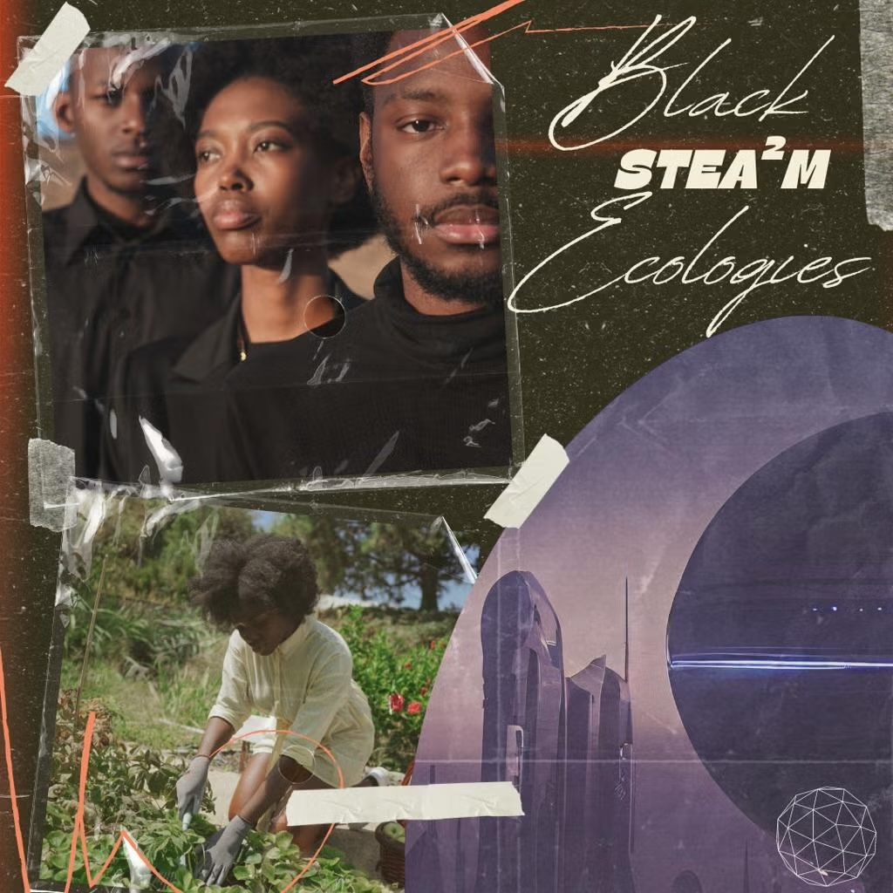
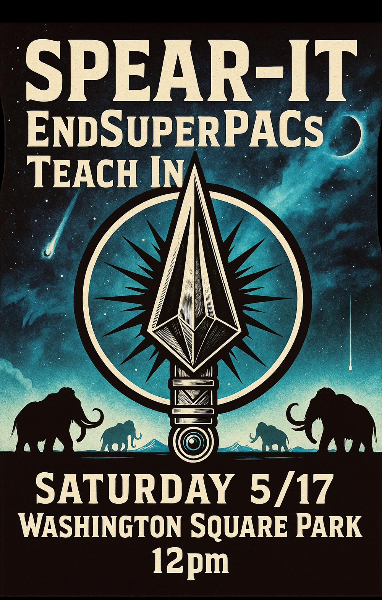
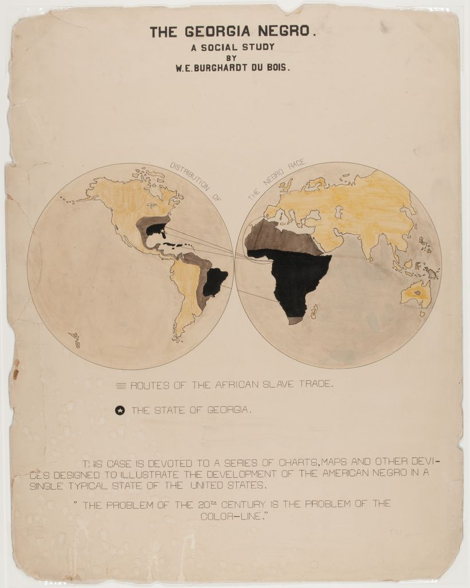

# [Woke Mind Movement](https://github.com/Woke-Mind/Movement)

- [create an issue to stay in touch](./aaa/how/onboard.md)

# we seek to woke our minds

- an adventure in social justice

## goals

- seeking colaborators of all ilk

- to build a decentralized woke mind network

- outside the gaze of evil big company social media

- public & private discussions | links | info

- resilient to web | infrastructure failure

- leverage git and other open source build tools

- privacy protected by industrial strength encryption

## news

- [A Hidden Camera Protest Turned the Tables on China’s Surveillance State](./aaa/news/A%20Hidden%20Camera%20Protest%20Turned%20the%20Tables%20on%20China’s%20Surveillance%20State%20-%20The%20New%20York%20Times.html)
- [The Chan-Zuckerbergs stopped funding social causes. 400 kids lost their school.](./aaa/news/Priscilla-Chan-and-Mark-Zuckerberg-philanthropy-pivot.pdf)
- [more...](./aaa/news/2025-09.md)

## projects

- [Early Arrival: 'Immigrants Are New York'](https://molab-itp.github.io/moSalon/src/videoplayer/?playlist=Axuf_zTf4TU)
- [woke-words](https://woke-mind.github.io/woke-words/words/) | [[-source-]](https://github.com/Woke-Mind/woke-words)
- [let-america-be](https://jht9629-nyu.github.io/let-america-be/src/qrcode/?group=s1) | [[-source-]](https://github.com/jht9629-nyu/let-america-be.git)
- [more...](./aaa/projects/2025-09.md)

## alliance

- [diversityschoolhouse](https://diversityschoolhouse.com/)

- [Just Conversations | This Moment in Immigration: What’s at Stake and What Can Be Done](https://www.bklynlibrary.org/calendar/just-conversations-moment-center-for-brooklyn-20250915-0630pm) - Mon, Sep 15 2025

- [free speech for people](https://freespeechforpeople.org/)

- [News That Speaks Your Language](https://documentedny.com/) Documented is an independent, non-profit newsroom dedicated to reporting with and for immigrant communities in New York City.

- [indivisiblebrooklyn.org](https://indivisiblebrooklyn.org/) Indivisible Brooklyn (INBK) is an all-volunteer, grassroots organization in Brooklyn dedicated to promoting civic participation and engagement in the fight for justice, sustainability, and equality.

- [End-SuperPACs-Overview](./aaa/spearit/End-SuperPACs-Overview.pdf) Stop billionaires from buying our democracy.

  - [Mammoth-Hunter-Manifesto](./aaa/spearit/Mammoth-Hunter-Manifesto.pdf) We do not seek power to dominate, but to distribute. Not to control, but to liberate.

  - [SPEAR-IT-Teach-In-Guide](./aaa/spearit/SPEAR-IT-Teach-In-Guide.pdf) "Who really runs America? Let's talk."

## history

- [Stay woke, keep your eyes open](https://www.snopes.com/articles/464795/origins-term-stay-woke/)

  - The phrase was used in a 1938 recording by Black folk singer Lead Belly.

- [more...](./aaa/history/stay-woke.md)

## Inspiration

- SICaaa
- Science | Imaaagination | Curiosity | [ art - activism - alliance ]

- [A World Drawn Together](https://www.caricature.org/)

- [The Algebra Project uses mathematics literacy as an organizing tool...](https://algebra.org/)

- [Algorithmic Justice League](https://www.ajl.org/)

- [Distributed AI Research Institute - technology that benefits everyone](https://www.dair-institute.org/)

- [Mind Storms](https://www.media.mit.edu/publications/mindstorms/) [[-pdf-]](https://worrydream.com/refs/Papert_1980_-_Mindstorms,_1st_ed.pdf)

- [Computing for a Purpose](https://www.media.mit.edu/projects/purpose-based-creative-computing-with-scratch/overview/) | [[-more...-]](./aaa/purpose/purpose.md)

- [daily BlackFacts](https://molab-itp.github.io/p5moLibrary/src/demo/BlackFacts/)

- [Black STEA2M Ecologies as a Technology of Social Justice](https://docs.google.com/document/d/1hHQGZnN6TYTDGmNqOLXRAgc7Jg9el40TTNQAIKxOGn8/edit?tab=t.0)
  - [Thompson-x-Coles](https://drive.google.com/drive/folders/1W5aV78mfMnCUd_tGkTPImS_fWFPKGYmO)
    We define Black STEA2M Ecologies as the networking of Blackness and innovation centered around STEA2M related topics that work across institutions, organizations, and communities to create sustainable pathways to wellness that uplift rather than harm Black people
  - [Northeast - Black STEA2M Ecologies as a Technology of Social Justice: A Workshop on Culture, Place and Technology to Sustain Personal and Societal Wellness](https://icc.ucla.edu/invited-workshop-concepts/)

- [[-more...-]](./aaa/inspiration/-inspiration.md)

## Past events

- 2025-05-17 May
- 

## Inspiration Inspiration

- 
  - W.E.B. Du Bois 1900: "THE PROBLEM OF THE 20th CENTURY IS THE PROBLEM OF THE COLOR-LINE."
  - [item source](https://www.loc.gov/pictures/collection/anedub/item/2013650420)
  - [collection source](https://www.loc.gov/pictures/collection/anedub/)
  - [webdb webdb](https://woke-mind.github.io/webdb/webdb/)
  - [W. E. B. Dubois a Biography in Four Voices - youtube intro](https://www.youtube.com/watch?v=WfsY2y7xrXo)
    <!-- - [metadeepmix webdb](http://metadeepmix.com/webdb/webdb/) -->
    <!-- - Woke Mind: "The problem since 1492 is white christian terrorism" -->
