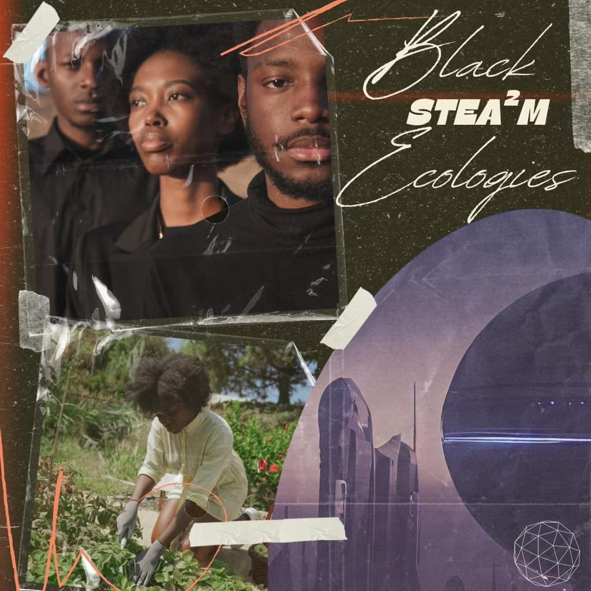
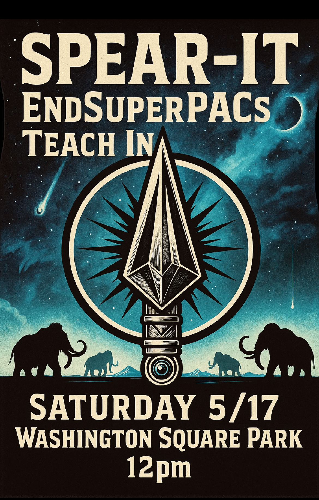
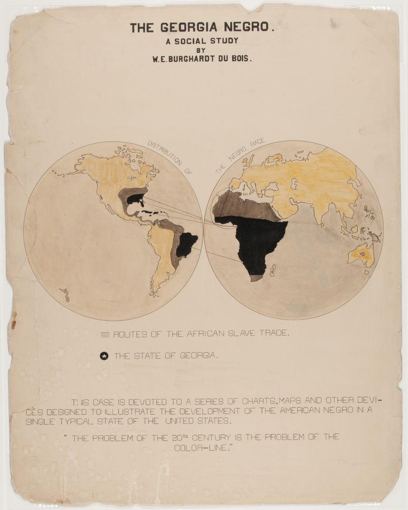

# [Woke Mind Movement](https://github.com/Woke-Mind/Movement)

- [create an issue to stay in touch](./aaa/how/onboard.md)
- [connect on Signal secure open source messaging app](https://signal.org/)

# we seek to woke our minds

- an adventure in social justice
- a resistance response to the 2021 anti-woke pandemic

## goals

- seeking colaborators of all ilk

- to build a decentralized woke mind network

- outside the gaze of evil for-profit social media companies

- public & private discussions/links/info

- resilient to web/infrastructure failure/attack

- leverage git and other open source build tools

- privacy protected by industrial strength encryption

## stream

- [Tracking U.S. Military Killings in Boat Attacks](https://www.nytimes.com/interactive/2025/10/29/us/us-caribbean-pacific-boat-strikes.html)
  - 66 Strikes 215 Killed - Updated 2026-06-24
  - 64 Strikes 208 Killed - Updated 2026-06-16

- [Lives Lost to ICE](https://icefalltracker.com/)
  - 2026 : 17 in custody \| 2 outside custody - Updated 2026-06-14
  - 2025: 29 in custody \| 9 outside custody

- [impact of closing USAID](https://www.google.com/search?q=impact+closing+usaid&rlz=1C5CHFA_enUS975US976&oq=impact+closing+usaid&gs_lcrp=EgZjaHJvbWUyBggAEEUYOTIICAEQABgWGB4yDQgCEAAYhgMYgAQYigUyBwgDEAAY7wUyBwgEEAAY7wUyCggFEAAYgAQYogQyBwgGEAAY7wUyCggHEAAYgAQYogTSAQg1ODAyajBqN6gCALACAA&sourceid=chrome&ie=UTF-8)
  - [One Year Later: The Effect of US ‘Chainsaw’ on Global Health](https://healthpolicy-watch.news/the-human-cost-one-year-after-the-us-took-a-chainsaw-to-global-health/)
    - health policy watch: 757,314 deaths - Written: 2026-01-20, Accessed: 2026-06-17
    - [Impact Metrics Dashboard](https://www.impactcounter.com/dashboard?view=table&sort=title&order=asc)
  - [USAID shutdown has led to hundreds of thousands of deaths](https://hsph.harvard.edu/news/usaid-shutdown-has-led-to-hundreds-of-thousands-of-deaths/)
    - Harvard School of Public Health - 2025-11-20
  
- [W. E. B. Du Bois, ‘Black America’, 1932](https://credo.library.umass.edu/cgi-bin/pdf.cgi?id=scua:mums312-b229-i058)
  
- [ruhabenjamin viral-justice](https://www.ruhabenjamin.com/viral-justice)
  
- [heathercoxrichardson](https://heathercoxrichardson.substack.com/)
  
- [Tad.Stoermer](https://www.youtube.com/@Tad.Stoermer)
  
- [Robert Reich](https://www.youtube.com/@RBReich)
  - [theguardian robert-reich](https://www.theguardian.com/profile/robert-reich)

## events

- [The 2026 Kahn Humanities Series Presents Professor Angela Y. Davis](https://www.bklynlibrary.org/calendar/2026-kahn-humanities-central-library-lobby-20260531-0700pm) 2026-05-31 Sun, May 31 7pm - 8:30pm
  - [on youtube](https://www.youtube.com/watch?v=pT11T8ltrl0)
    
- [Printing Black America: Du Bois's Data Portraits in the 21st Century](https://www.bklynlibrary.org/exhibitions/printing-black-america-du) 2026-Feb-17 - 2026-May-31 @ [Brooklyn Central Library](https://www.bklynlibrary.org/locations/central)

- [Dr. Ilyasah Shabazz Discusses Malcolm in the Desert, with Nikole Hannah-Jones](https://www.bklynlibrary.org/calendar/dr-ilyasah-shabazz-central-library-dweck-20260520-0700pm) 2026-05-20
  
- [AI Can't Fund You, But Your Customer Calls Might](https://luma.com/k1z670h2) 2026-04-28
  
- [NYC Film Premiere - W.E.B. Du Bois: Rebel With A Cause](https://event.newschool.edu/nycfilmpremier-webdubois) 2026-04-27

- [NYU Female Founders Lunch](https://luma.com/eb3jnlx9) 2026-04-24

- [Just Conversations \| This Moment in Immigration: What’s at Stake and What Can Be Done](https://www.bklynlibrary.org/calendar/just-conversations-moment-center-for-brooklyn-20250915-0630pm) - Mon, Sep 15 2025

## news

- [documentedny.com immigration](https://documentedny.com/category/english/immigration)

- [US Law Enforcement Warns of ‘Anti-Tech Extremism’ as AI Hatred Grows
](https://www.wired.com/story/us-law-enforcement-warns-of-anti-tech-extremism/)

- [Children of the Movement: Growing up with Parents in the Black Panther Party](https://www.youtube.com/watch?v=bLxO8E-YEtk&list=PLFtEjc__6pNpAdZGPl8ZJNyyahZJWjH9R&index=37)
- [How Movements Are Built - video](https://www.youtube.com/watch?v=fpfBgBomWMk&list=PLFtEjc__6pNpAdZGPl8ZJNyyahZJWjH9R&index=2)

- [Dark Money Hit a Record High of $1.9 Billion in 2024 Federal Races](https://www.brennancenter.org/our-work/research-reports/dark-money-hit-record-high-19-billion-2024-federal-races)

- [Elon Musk tops list of 2024 political donors, but five others gave more than $100 million](https://www.opensecrets.org/news/2025/03/elon-musk-tops-list-of-2024-political-donors-but-six-others-gave-more-than-100-million)

- [Politics Chat](https://www.youtube.com/watch?v=9PstJa1nf4Y) Heather Cox Richardson, February 26, 2026

- [Elon Musk’s $1 trillion pay day](https://electrek.co/2025/10/25/elon-musks-1-trillion-stock-award-gets-more-ridiculous-the-more-you-look-into-it/) gets more ridiculous the more you look into it

- [A Hidden Camera Protest Turned the Tables on China’s Surveillance State](https://www.nytimes.com/2025/09/02/business/china-chongqing-protest.html)
  - [Archived](./aaa/news/A%20Hidden%20Camera%20Protest%20Turned%20the%20Tables%20on%20China’s%20Surveillance%20State%20-%20The%20New%20York%20Times.html) [the note](aaa/news/China-hidden-camera-protest-note.png)

- [The Chan-Zuckerbergs stopped funding social causes. 400 kids lost their school.](./aaa/news/Priscilla-Chan-and-Mark-Zuckerberg-philanthropy-pivot.pdf)

- [more...](./aaa/news/2025-09.md)

## projects

- [Early Arrival: 'Immigrants Are New York'](https://molab-itp.github.io/moSalon/src/videoplayer/?playlist=Axuf_zTf4TU) - [[-source-]](https://documentedny.com/2025/10/20/no-kings-rally-nyc/)

- [woke-words](https://woke-mind.github.io/woke-words/words/) - [[-source-]](https://github.com/Woke-Mind/woke-words)

- [let-america-be](https://jht9629-nyu.github.io/let-america-be/src/qrcode/?group=s1) [[-source-]](https://github.com/jht9629-nyu/let-america-be.git)

- [more...](./aaa/projects/2025-09.md)

## alliance

- [documentedny.com immigration](https://documentedny.com/category/english/immigration)

- [Blacksky Algorithms](https://github.com/blacksky-algorithms) builds open-source, community-driven infrastructure for decentralized social media

- [Dream Opportunity](https://www.dreamopportunity.org/) Connecting students with big brands to help them discover their Dream Opportunity. [formerly thediversity.org](https://www.thediversity.org/)
  - [Entrepreneurship at NYU](https://entrepreneur.nyu.edu/)

- [AskMabel](https://www.labs.robinhood.org/portfolio/askmabel) Building a community of digitally resilient seniors, one step at a time. [[-site-]](https://www.askmabel.org/)
  - [Blue ridge labs](https://www.labs.robinhood.org/) turns bold ideas into impact

- [free speech for people](https://freespeechforpeople.org/) challenging big money in politics, confronting corruption in government...

- [News That Speaks Your Language](https://documentedny.com/) Documented is an independent, non-profit newsroom dedicated to reporting with and for immigrant communities in New York City.

- [indivisiblebrooklyn.org](https://indivisiblebrooklyn.org/) Indivisible Brooklyn (INBK) is an all-volunteer, grassroots organization in Brooklyn dedicated to promoting civic participation and engagement in the fight for justice, sustainability, and equality.

- [diversityschoolhouse](https://diversityschoolhouse.com/) Empower every voice:
  Culturally rich lessons for inclusive education

- [End-SuperPACs-Overview](./aaa/spearit/End-SuperPACs-Overview.pdf) Stop billionaires from buying our democracy.
  - [Mammoth-Hunter-Manifesto](./aaa/spearit/Mammoth-Hunter-Manifesto.pdf) We do not seek power to dominate, but to distribute. Not to control, but to liberate.

  - [SPEAR-IT-Teach-In-Guide](./aaa/spearit/SPEAR-IT-Teach-In-Guide.pdf) "Who really runs America? Let's talk."

## history

- [Stay woke, keep your eyes open](https://www.snopes.com/articles/464795/origins-term-stay-woke/)
  - The phrase was used in a 1938 recording by Black folk singer Lead Belly.

- [more...](./aaa/history/stay-woke.md)

## Inspiration

- [Creative Computing Club House Brooklyn](https://github.com/CCCHBK/_)
  
- Science \| Imaaagination \| Curiosity \| [ art - activism - alliance ]

- [A World Drawn Together](https://www.caricature.org/)

- [The Algebra Project uses mathematics literacy as an organizing tool...](https://algebra.org/)

- [Algorithmic Justice League](https://www.ajl.org/)

- [Distributed AI Research Institute - technology that benefits everyone](https://www.dair-institute.org/)

- [Mind Storms](https://www.media.mit.edu/publications/mindstorms/) [[-pdf-]](https://worrydream.com/refs/Papert_1980_-_Mindstorms,_1st_ed.pdf)

- [Computing for a Purpose](https://www.media.mit.edu/projects/purpose-based-creative-computing-with-scratch/overview/) \| [[-more...-]](./aaa/purpose/purpose.md)

- [daily BlackFacts](https://molab-itp.github.io/p5moLibrary/src/demo/BlackFacts/)

- [Black STEA2M Ecologies as a Technology of Social Justice](https://docs.google.com/document/d/1hHQGZnN6TYTDGmNqOLXRAgc7Jg9el40TTNQAIKxOGn8/edit?tab=t.0)
  - [Thompson-x-Coles](https://drive.google.com/drive/folders/1W5aV78mfMnCUd_tGkTPImS_fWFPKGYmO)
    We define Black STEA2M Ecologies as the networking of Blackness and innovation centered around STEA2M related topics that work across institutions, organizations, and communities to create sustainable pathways to wellness that uplift rather than harm Black people
  - [Northeast - Black STEA2M Ecologies as a Technology of Social Justice: A Workshop on Culture, Place and Technology to Sustain Personal and Societal Wellness](https://icc.ucla.edu/invited-workshop-concepts/)

- [[-more...-]](./aaa/inspiration/-inspiration.md)

## Past events

- 2025-05-17 May
- 

## Inspiration Inspiration

- 
  - W.E.B. Du Bois 1900: "THE PROBLEM OF THE 20th CENTURY IS THE PROBLEM OF THE COLOR-LINE."
  - 2026: "The problem for centuries is White Christian Terrorism"
  - [item source](https://www.loc.gov/pictures/collection/anedub/item/2013650420)
  - [collection source](https://www.loc.gov/pictures/collection/anedub/)
  - [webdb webdb](https://woke-mind.github.io/webdb/webdb/)
  - [W. E. B. Dubois a Biography in Four Voices - scribe catalog](https://scribe.org/catalogue/web-du-bois-biography-four-voices)
    <!-- - [metadeepmix webdb](http://metadeepmix.com/webdb/webdb/) -->
    <!-- - Woke Mind: "The problem since 1492 is white christian terrorism" -->

## [Private Enclave Repo](https://github.com/Woke-Mind/Enclave)

- to gain access contact by creating a github issues in this repo
